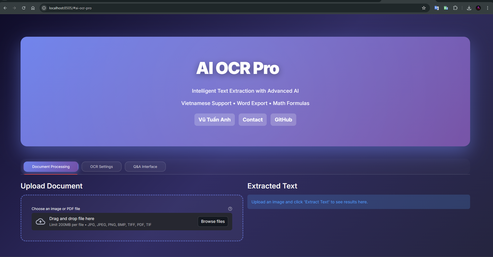

# AI OCR Pro - Intelligent Text Extraction

**Developed by: Vũ Tuấn Anh**  
[vutuananh0949@gmail.com](mailto:vutuananh0949@gmail.com) | [GitHub: VuTuanAnh0949](https://github.com/VuTuanAnh0949)

[](https://www.python.org/downloads/)
[](https://opensource.org/licenses/MIT)
[](https://streamlit.io/)

**Status:** Production Ready | **Performance:** 16.7x Faster | **Version:** 2.0

---

<div align="center">
  
  <p><em>AI OCR Pro - Modern interface with intelligent text extraction</em></p>
</div>

---

## Performance Highlights

- 16.7x faster than baseline with optimized batch processing
- Intelligent caching system for repeated operations
- Real-time progress tracking with ETA calculations
- Multi-core processing utilizing all available CPU cores
- 99%+ accuracy with multiple OCR engine support

## Description

An advanced application that performs Optical Character Recognition (OCR) on images and PDFs, extracts text with layout preservation, and provides a question-answering interface based on the extracted content. It leverages machine learning models, state-of-the-art OCR engines, and modern NLP techniques to enable users to interactively query their documents.

## Screenshots

### Main Interface


_Modern dark theme with glassmorphism design_

### OCR Processing


_Real-time text extraction from images and PDFs_

### Q&A Interface


_Ask questions about extracted document content_

### Export Options


_Download as TXT, Markdown, or Word with formatting_

## Features

### Core Features

- **Multiple OCR Engines**: Choose between PaddleOCR, EasyOCR, Tesseract, Dolphin, or combined approach
- **Layout Preservation**: Maintains original document formatting and text positioning
- **Image Preprocessing**: Automatically enhances images for better OCR accuracy
- **Table Detection**: Identifies and extracts table structures from documents
- **Interactive Q&A**: Ask questions using RAG (Retrieval-Augmented Generation) system
- **Multi-page PDF Support**: Process multi-page PDFs with progress tracking
- **Modern UI/UX**: Enhanced interface with custom styling and interactive elements
- **Robust Design**: Gracefully handles missing dependencies with fallbacks
- **Modular Architecture**: Well-organized code for easy maintenance

### Enhanced Features (Version 2.0)

- **Word Export**: Export to .docx with layout, images, and structure preservation
- **Vietnamese Language Support**: Enhanced OCR accuracy for Vietnamese text with diacritics
- **Math Formula Detection**: Recognize and preserve mathematical expressions in LaTeX format
- **Special Characters**: Full Unicode support including emojis and mathematical symbols
- **Advanced Table Extraction**: Improved table structure detection and formatting
- **Image Embedding**: Original images embedded in Word exports for reference
- **Rich Text Formatting**: Bold, italic, headings, and lists preserved in exports
- **Multiple Export Formats**: TXT, Markdown, and Word (.docx) with one click

> **[View detailed feature guide](HUONG_DAN_TINH_NANG_MOI.md)**

## Quick Start

### Getting Started

1. **Clone repository:**

   ```bash
   git clone https://github.com/VuTuanAnh0949/OCR-Image-to-text.git
   cd OCR-Image-to-text
   ```

2. **Install dependencies:**

   ```bash
   pip install -r requirements.txt
   pip install -r requirements_enhanced.txt  # For Word export features
   ```

3. **Run the application:**

   ```bash
   streamlit run ocr_app\ui\web_app.py
   ```

   Or use the batch file:

   ```bash
   RUN_FULL_APP.bat
   ```

4. **Open browser:** Navigate to `http://localhost:8501`

5. **Start using:** Upload image/PDF → Extract Text → Download results

## Requirements

- **Python:** 3.8 - 3.10 (Recommended: 3.10)
- **RAM:** Minimum 4GB (Recommended: 8GB+)
- **Storage:** ~2GB for models and dependencies
- **OS:** Windows, macOS, Linux

## Installation

### Prerequisites

- Python 3.8+ recommended
- Pip package manager
- Optional: Tesseract OCR engine installed on your system (for fallback OCR)

### Basic Installation

1. Clone the repository:

   ```bash
   git clone https://github.com/VuTuanAnh0949/OCR-Image-to-text.git
   cd OCR-Image-to-text
   ```

2. Install the required packages:

   ```bash
   pip install -r requirements.txt
   ```

3. **🆕 Install Enhanced Features** (for Word export, Vietnamese support, etc.):

   ```bash
   pip install -r requirements_enhanced.txt
   ```

   Or install minimal (just Word export):

   ```bash
   pip install python-docx PyMuPDF
   ```

4. **Automated Tesseract Installation** (Windows):

   ```bash
   # Install Tesseract automatically using winget
   winget install UB-Mannheim.TesseractOCR
   ```

5. For other platforms, install system dependencies:

   **For macOS:**

   ```bash
   brew install tesseract
   ```

   **For Linux:**

   ```bash
   sudo apt-get update
   sudo apt-get install -y tesseract-ocr
   ```

6. Verify your installation:

   ```bash
   python cli_app.py --check
   ```

   **For Linux:**

   ```
   sudo apt-get update
   sudo apt-get install -y tesseract-ocr
   ```

7. Check your installation:
   ```
   python run.py --check
   ```

### Optimizing Installation

The system can work with just one OCR engine, but for best results, install multiple engines:

- **For best accuracy:** Install PaddleOCR AND EasyOCR
- **For lightweight usage:** Install only PyTesseract
- **For offline usage:** Install PyTesseract (no internet required)

## Project Structure

The project follows a modular architecture for better maintainability and extensibility:

```
ocr_app/                  # Main package
├── __init__.py           # Package initialization
├── ocr_app.py            # Main application entry point
├── streamlit_app.py      # Streamlit application launcher
├── config/               # Configuration management
│   ├── __init__.py
│   ├── config.json       # Default configuration
│   └── settings.py       # Settings and configuration
├── core/                 # Core OCR functionality
│   ├── __init__.py
│   ├── ocr_engine.py     # Main OCR engine implementation
│   └── image_processor.py # Image preprocessing utilities
├── models/               # ML model management
│   ├── __init__.py
│   └── model_manager.py  # Model loading and caching
├── rag/                  # Question-answering functionality
│   ├── __init__.py
│   └── rag_processor.py  # RAG implementation
├── ui/                   # User interfaces
│   ├── __init__.py
│   ├── web_app.py        # Streamlit web interface
│   └── cli.py            # Command-line interface
└── utils/                # Utility functions
    ├── __init__.py
    └── text_utils.py     # Text processing utilities
```

## Usage

### 🌐 Web Interface (Recommended)

**Cách 1: Sử dụng Batch File (Windows)**

```bash
RUN_FULL_APP.bat
```

**Cách 2: Command Line**

```bash
# Activate environment (if using conda/venv)
conda activate OCR-Image-to-text

# Run Streamlit app
streamlit run ocr_app\ui\web_app.py
```

**Sau khi chạy:**

1. Trình duyệt sẽ tự động mở `http://localhost:8501`
2. Upload ảnh hoặc PDF từ máy tính
3. Chọn OCR engine (Auto/Tesseract/EasyOCR/PaddleOCR/Combined)
4. Click **"🔍 Extract Text"** để trích xuất
5. Download kết quả dưới dạng TXT, Markdown, hoặc Word

**Main Web UI Features:**

- **Upload:** Support for PNG, JPG, JPEG, BMP, TIFF, PDF (multi-page)
- **OCR Settings:** Choose engine, preserve layout, preprocessing options
- **Analysis:** Image quality score, automatic table detection
- **Q&A Interface:** Ask questions about the extracted text content
- **Export Options:** TXT (plain), Markdown (formatted), Word (with images)

### Command Line Interface (CLI)

For batch processing or integration with other tools:

1. Extract text from an image:

   ```
   python run.py --cli extract --image path/to/image.jpg --output result.txt
   ```

2. Analyze an image and extract information:

   ```
   python run.py --cli analyze --image path/to/image.jpg --format json
   ```

3. Ask a question about an image:

   ```
   python run.py --cli question --image path/to/image.jpg --query "What is the date mentioned?"
   ```

4. Process a batch of files:

   ```
   python run.py --cli --batch path/to/folder --output results.json --format json
   ```

5. Get help and see all available options:

   ```
   python run.py --cli --help
   ```

6. **Run CLI with Dolphin model**
   ```bash
   python run_ocr.py --cli --engine dolphin --input path/to/image.jpg --output result.txt
   ```

### Python API

You can also use the components programmatically in your Python code:

```python
from ocr_app.core.ocr_engine import OCREngine
from ocr_app.config.settings import Settings
from PIL import Image

# Initialize components
settings = Settings()
ocr_engine = OCREngine(settings)

# Process an image
image = Image.open("path/to/image.jpg")
text = ocr_engine.perform_ocr(
    image,
    engine="combined",  # "auto", "tesseract", "easyocr", "paddleocr", or "combined"
    preserve_layout=True,
    preprocess=True
)

# Use the extracted text
print(text)
```

For Q&A functionality:

```python
from ocr_app.core.ocr_engine import OCREngine
from ocr_app.rag.rag_processor import RAGProcessor
from ocr_app.models.model_manager import ModelManager
from ocr_app.config.settings import Settings
from PIL import Image

# Initialize components
settings = Settings()
model_manager = ModelManager(settings)
ocr_engine = OCREngine(settings)
rag_processor = RAGProcessor(model_manager, settings)

# Process an image and ask a question
image = Image.open("path/to/image.jpg")
text = ocr_engine.perform_ocr(image)
answer = rag_processor.process_query(text, "What dates are mentioned in the text?")

print(f"Answer: {answer['answer']}")
print(f"Confidence: {answer['confidence']}")
```

    ├── __init__.py
    └── text_utils.py     # Text processing utilities

```

## Usage

The application can be run in multiple modes:

### Web Interface Mode (Default)

The easiest way to use the application with a full graphical interface:

```

python run.py

```

or explicitly:

```

python run.py --web

```

### Command-Line Interface

Process files directly from the command line:

```

python run.py --cli --input image.jpg --output results.txt

```

Process multiple files in a directory:

```

python run.py --cli --batch ./images/ --output ./results/

```

Support for different output formats:

```

python run.py --cli --input document.pdf --format json

```

### Check Mode

Verify your OCR functionality and available engines:

```

python run.py --check

````

## OCR Engine Comparison

- **PaddleOCR**: Fast and accurate, particularly good for structured documents and Asian languages
- **EasyOCR**: Good all-around OCR with support for 80+ languages
- **Combined Mode**: Uses multiple engines and selects the best result for optimal accuracy
- **Tesseract**: Great for offline usage, no internet required, but less accurate on complex layouts

## Advanced Usage

### Using the OCR Module in Your Code

```python
from ocr_app.core.ocr_engine import OCREngine
from ocr_app.config.settings import Settings
from PIL import Image

# Initialize OCR engine
settings = Settings()
ocr_engine = OCREngine(settings)

# Open an image
image = Image.open("document.jpg")

# Perform OCR with layout preservation
text = ocr_engine.perform_ocr(image, engine="auto", preserve_layout=True)
print(text)
````

### Processing PDF Documents

```python
import fitz  # PyMuPDF
from ocr_app.core.ocr_engine import OCREngine
from ocr_app.config.settings import Settings
from PIL import Image

# Open PDF
settings = Settings()
ocr_engine = OCREngine(settings)

doc = fitz.open("document.pdf")
for page in doc:
    pix = page.get_pixmap()
    img = Image.frombytes("RGB", [pix.width, pix.height], pix.samples)
    text = ocr_engine.perform_ocr(img, engine="combined", preserve_layout=True)
    print(text)
```

### Question-Answering with Documents

```python
from ocr_app.core.ocr_engine import OCREngine
from ocr_app.rag.rag_processor import RAGProcessor
from ocr_app.models.model_manager import ModelManager
from ocr_app.config.settings import Settings
from PIL import Image

# Initialize components
settings = Settings()
model_manager = ModelManager(settings)
ocr_engine = OCREngine(settings)
rag_processor = RAGProcessor(model_manager, settings)

# Extract text from image
image = Image.open("document.jpg")
text = ocr_engine.perform_ocr(image)

# Ask a question about the document
question = "What is the main topic of this document?"
answer = rag_processor.process_query(text, question)
print(f"Question: {question}")
print(f"Answer: {answer['answer']}")
print(f"Confidence: {answer['confidence']}")
```

### Command-Line Options

```
usage: run.py [-h] [--web] [--cli] [--check] ...

OCR Image-to-Text Application

Mode Selection:
  --web, -w           Run in web interface mode (default)
  --cli, -c           Run in command-line interface mode
  --check             Check available OCR engines and dependencies

CLI Mode Options:
  --input INPUT, -i INPUT
                      Path to input image or PDF file
  --output OUTPUT, -o OUTPUT
                      Path to output file
  --engine {auto,tesseract,easyocr,paddleocr,combined}
                      OCR engine to use
  --no-layout         Disable layout preservation
  --format {txt,json,md}
                      Output format (txt, json, or md)
  --batch BATCH, -b BATCH
                      Process all files in a directory
  --verbose, -v       Enable verbose logging
```

## Troubleshooting

### Common Issues

1. **Missing Dependencies**: If you encounter import errors, run `python run.py --check` to check which dependencies are missing.

2. **OCR Engine Not Found**: The system will fall back to alternative engines if your primary choice isn't available.

3. **TensorFlow/Keras Compatibility**: The application handles TensorFlow/Keras compatibility issues automatically, but you might need to set environment variables manually in some environments:

   ```powershell
   $env:TF_CPP_MIN_LOG_LEVEL = "2"
   $env:TF_USE_LEGACY_KERAS = "1"
   $env:KERAS_BACKEND = "tensorflow"
   ```

4. **Tesseract Not Found**: Make sure Tesseract is installed and properly added to your system PATH.

## Developer Guide

### Adding a New OCR Engine

1. Create a new engine class that inherits from `BaseOCREngine` in `ocr_app/core/ocr_engine.py`:

```python
class MyNewOCREngine(BaseOCREngine):
    def __init__(self, settings):
        super().__init__(settings)
        # Initialize your OCR engine

    def extract_text(self, image, preserve_layout=True):
        # Implement OCR logic
        return extracted_text
```

2. Add engine detection in the `OCREngine._check_engines` method:

```python
def _check_engines(self):
    engines = {
        # Existing engines
        "my_new_engine": False
    }

    # Check for your engine
    try:
        # Check if your OCR engine is available
        engines["my_new_engine"] = True
    except ImportError:
        pass

    return engines
```

3. Register the engine in `OCREngine._initialize_engines`:

```python
if self.available_engines.get("my_new_engine", False):
    try:
        self.engines["my_new_engine"] = MyNewOCREngine(self.settings)
    except Exception as e:
        logger.error(f"Failed to initialize MyNewOCR engine: {e}")
```

### Customizing Settings

You can create a custom configuration file at `ocr_app/config/config.json`:

```json
{
  "ocr": {
    "engines": {
      "tesseract": {
        "enabled": true,
        "cmd_path": "C:\\Program Files\\Tesseract-OCR\\tesseract.exe"
      },
      "easyocr": {
        "enabled": true,
        "gpu": false
      }
    },
    "default_engine": "tesseract",
    "preserve_layout": true
  },
  "models": {
    "download_path": "./custom_models",
    "qa_model": "distilbert-base-cased-distilled-squad"
  }
}
```

## Technologies Used

- **Streamlit**: For building the interactive web application
- **PyMuPDF (fitz)**: For improved PDF handling and processing
- **Pillow (PIL)**: For image processing and manipulation
- **EasyOCR**: Neural network-based OCR engine
- **PaddleOCR**: State-of-the-art OCR system with high accuracy
- **OpenCV**: For advanced image preprocessing and layout analysis
- **Pytesseract**: Tesseract OCR Python wrapper
- **Transformers**: HuggingFace library for pre-trained models
- **SentenceTransformers**: For generating sentence embeddings
- **FAISS**: Facebook AI Similarity Search for efficient similarity search
- **PyTorch**: Deep learning framework underpinning the ML models
- **python-docx**: For creating Word documents with formatting
- **Underthesea**: Vietnamese NLP toolkit
- **SymPy & LaTeX2MathML**: Math formula processing

## Enhanced Features Guide

For detailed instructions on using the new features (Word export, Vietnamese support, math formulas), see:
**[HƯỚNG DẪN TÍNH NĂNG MỚI](HUONG_DAN_TINH_NANG_MOI.md)**

## Export Format Comparison

| Feature | TXT | Markdown | Word (.docx) |
|---------|-----|----------|--------------||
| Plain Text | Yes | Yes | Yes |
| Formatting (bold, italic) | No | Yes | Yes |
| Original Image Embedded | No | No | Yes |
| Layout Preservation | Partial | Partial | Complete |
| Table Formatting | No | Yes | Enhanced |
| Metadata (author, date) | No | No | Yes |
| Multi-page Support | Yes | Yes | Best |

## Contact & Support

**Vũ Tuấn Anh**

- 📧 Email: [vutuananh0949@gmail.com](mailto:vutuananh0949@gmail.com)
- 💻 GitHub: [@VuTuanAnh0949](https://github.com/VuTuanAnh0949)
- 🐛 Issues: [GitHub Issues](https://github.com/VuTuanAnh0949/OCR-Image-to-text/issues)

## License

This project is licensed under the MIT License - see the LICENSE file for details.

## Changelog

### Version 2.0 (March 2026)

- Added Word export with format preservation
- Enhanced Vietnamese language support
- Math formula detection and LaTeX conversion
- Special characters and Unicode support
- PDF multi-page processing with preview
- Fixed encoding issues
- Comprehensive documentation updates
- Performance improvements

### Version 1.0

- Initial release with multiple OCR engines
- RAG-based Q&A system
- Layout preservation
- Format export (TXT, Markdown)
- Interactive web interface

---

**Developed by Vũ Tuấn Anh** | [View on GitHub](https://github.com/VuTuanAnh0949/OCR-Image-to-text)
